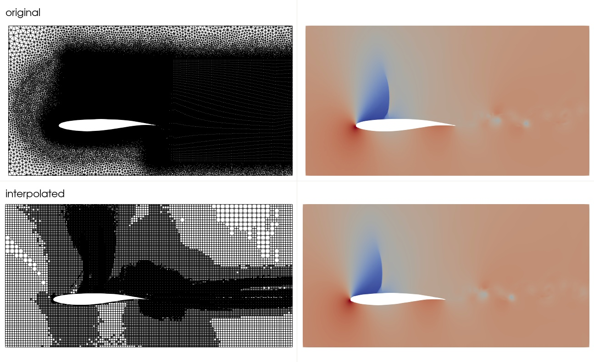

# Sparse Spatial Sampling ($S^3$)
A different version of the existing $S^3$ algorithm (see [references](#References)) for processing large amounts of CFD data. 
The idea is to create a grid based on a metric provided by the user, e.g., the standard deviation of the pressure fields 
over time. The $S^3$ algorithm then generates a grid which captures *x%* of the metric from the original grid or contains
a specified max. number of cells, depending on the setup given by the user. After generating the grid, the original CFD 
data is interpolated onto the sampled grid and exported to HDF5 & XDMF files.

When applying $S^3$ to an OAT15 airfoil at high-speed stall conditions, it efficiently decreases the mesh size with minimal
loss of information:



The upper row shows the original grid and pressure field at an arbitrary time step while the lower row presents the 
grid generated by $S^3$ and the corresponding flow field on that grid.
Although the grid generated by $S^3$ contains $\approx$ *60%* less cells, it is still able to capture the flow field 
accurately since it only generates cells in regions where the gradient of the metric is high. 

## Getting started
To get started with $S^3$ you can check out the tutorials provided:

| # | topic                                                                    | notebook                                                          |
|--:|:-------------------------------------------------------------------------|:------------------------------------------------------------------|
| 1 | 2D flow past a cylinder                                                  | [view](./docs/source/tutorials/tutorial1_cylinder2D_Re100.ipynb)  |
| 2 | OAT15 at high speed stall conditions                                     | [view](./docs/source/tutorials/tutorial2_oat15_buffet.ipynb)      |
| 3 | How to select the best settings and advanced options                     | [view](./docs/source/tutorials/tutorial3_select_settings.ipynb)   |
| 4 | Loading existing *s_cube* objects and export options                     | [view](./docs/source/tutorials/tutorial4_export_options.ipynb)    |

To view out all the available workflows, as well as the $S^3$ API, you can check out the 
[documentation](https://sparsespatialsampling.readthedocs.io/en/latest/) of $S^3$. 

**Note:** There are some issues, which may arise when visualizing the results of $S^3$ in Paraview. 
See section [issues](#Issues) for known issues and their solution.

## Installation of $S^3$
### Local machine
For executing $S^3$, it is recommended to create a virtual environment. Otherwise, it need to be ensured that the Numpy 
version is $\ge 1.22$ (requirement for numba).

    # install venv
    sudo apt update && sudo apt install python3.12-venv

    # clone the S^3 repository 
    git clone https://github.com/JanisGeise/sparseSpatialSampling.git

    # create a virtual environment inside the repository
    python3.12 -m venv s_cube_venv

    # activate the environment and install all dependencies
    source s_cube_venv/bin/activate
    pip install --upgrade pip
    pip install -r requirements.txt

    # once everything is installed, leave the environment
    deactivate

To check if the installation was successful activate the Python environment and type `s_cube.__version__` 
(should display the current version).
For executing the example scripts in `examples/`, the CFD data must be provided. Further the paths to the data as well
as the setup needs to be adjusted accordingly. A script can then be executed as
    
    # start the virtual environment
    source s_cube_venv/bin/activate

    # add the path to the repository
    . source_path

    # execute a script
    cd examples/
    python3 s3_for_cylinder2D.py

### HPC
The setup for executing $S^3$ on an HPC cluster is the same as for the local machine. 
An example jobscript for executing $S^3$ on the *cylinder3D_Re3900* simulation may look like:

    #!/bin/bash
    #SBATCH --nodes=1
    #SBATCH --ntasks-per-node=72
    #SBATCH --time=08:00:00
    #SBATCH --job-name=s_cube
    
    # load python
    module load release/24.04  GCCcore/13.3.0
    module load Python/3.12.3
    
    # activate venv
    source s_cube_venv/bin/activate
    
    # add the path to s_cube
    . source_path
    
    # path to the python script
    cd examples/
    
    python3 cylinder3D_Re3900.py &> "log.main"

An [example jobscript](example_jobscript) for the
[Barnard](https://compendium.hpc.tu-dresden.de/jobs_and_resources/barnard/) HPC of TU Dresden is provided.

## Performing an SVD
Once the grid is generated and a field is interpolated, an SVD from this field can be computed:

    from sparseSpatialSampling.utils import write_svd_s_cube_to_file

    # compute SVD on grid generated by S^3 and export the results to HDF5 & XDMF
    write_svd_s_cube_to_file(field_names, save_path, save_name, new_file, n_modes, rank)

The HDF5 file will contain the following quantities:

- cell area (2D) / cell volume (3D)
- one field for each exported mode
- all singular values
- all temporal mode coefficients

The singular values and mode coefficients are not referenced in the XDMF file since they don't match the 
size of the field and can therefore not be visualized in ParaView. 
Before performing the SVD, the fields are weighted with the square-root of the cell areas (volumes) to improve the accuracy and 
comparability. 
This weighting is accounted for prior exporting the results of the SVD, however, it needs to be kept in mind when comparing 
the results to SVDs executed on the original (potentially unweighted) data.

The `Datawriter` class provides a common interface for exporting $S^3$ data and can be used to write other data to HDF5 and XDMF as well (here only shown for an SVD).

## General notes

### Interpolation of the original CFD data
- once the grid is generated, the original fields from CFD can be interpolated onto this grid using the `ExportData` 
class
- therefore, each field that should be interpolated has to be provided as tensor with the size 
`[n_cells, n_dimensions, n_snapshots]`.
- a scalar field has to be of the size `[n_cells, 1, n_snapshots]`
- a vector field has to be of the size `[n_cells, n_entries, n_snapshots]`
- the snapshots can either be passed into `export` method all at once, in batches, or each snapshot separately
depending on the size of the dataset and available RAM 

### Memory requirements
The grid generation currently requires the storage of the complete tree structure when creating the mesh, which is a
bottleneck for large meshes (see section *known issues*). 
A solution for this issue will be implemented in future versions of $S^3$.

For the interpolation and export of fields, the RAM needs to be large enough to hold at least:
- a single snapshot of the original grid
- the original grid
- the interpolated grid (size depends on the specified target metric)
- the levels of the interpolated grid (size depends on the specified target metric)
- a snapshot of the interpolated field (size depends on the specified target metric)

## Documentation
To build the documentation for $S^3$ first `sphinx` has to be installed:

````
pip3 install sphinx sphinx_rtd_theme nbsphinx recommonmark
````
you can then build the documentation by running
````
cd docs/
make html
````

## Unit tests
To perform unit tests, `pytest` has to be installed via

```
pip install pytest
```
To perform all available unit tests, execute

```
pytest sparseSpatialSampling/tests/
```

To execute a specific unit test, e.g., for the `Dataloader` module, execute

```
pytest sparseSpatialSampling/tests/test_s_cube_dataloader.py
```

Note that these commands have to be executed from the top-level of the repository.
## Issues
If you have any questions or something is not working as expected, feel free to open up a new 
[issue](https://github.com/JanisGeise/sparseSpatialSampling/issues). There are some known issues, which are listed below.

### Out of memory when performing the mesh generation for large meshes

- when dealing with a large number of cells which have to be created, $S^3$ will eventually run out of memory
- this issue occurs in the order of $N_{cells} \approx 1.5e8$ cells, depending on the available memory maybe sooner
- this issue is caused, because currently $S^3$ holds the complete sampling tree of the mesh in memory, a solution for
this issue will be implemented in future versions of $S^3$.

As a work-around for now, the number of mesh cells to generate can be limited by the argument *n_cells_max*, e.g.:

```
s_cube = SparseSpatialSampling(vertices, metric, [domain, geometry], save_dir, save_name, write_times=write_times,
                               n_jobs=126, n_cells_max=1e8)
```

In general, if both a value for *min_metric* and *n_cells_max* is provided, the value for *min_metric* will be ignored.

### Significant increase in runtime when using STL files as geometry objects

- when having STL files with many points, this will lead to a significant increase in runtime of $S^3$
- to counter this problem, the `GeometrySTL3D` geometry object provides a compression functionality using the keyword `reduce_by`, which 
decreases the number of points within the STL file
- since the final grid will only be an approximation of the geometry, this factor can be set very high (depending on the STL file),
values of `reduce_by=0.9 ... 0.98` were tested successfully (`0` means no compression)

## References
- Existing version of the $S^3$ algorithm can be found under: 
  - **D. Fernex, A. Weiner, B. R. Noack and R. Semaan.** *Sparse Spatial Sampling: A mesh sampling algorithm for efficient 
  processing of big simulation data*, DOI: https://doi.org/10.2514/6.2021-1484 (January, 2021).
- Idea & 1D implementation of the current version taken from [Andre Weiner](https://github.com/AndreWeiner)
- the [flow_data](https://github.com/AndreWeiner/flow_data/) repository containing the implementation of the 
*cylinder2D_Re100* and *cylinder3D_Re3900* test cases
